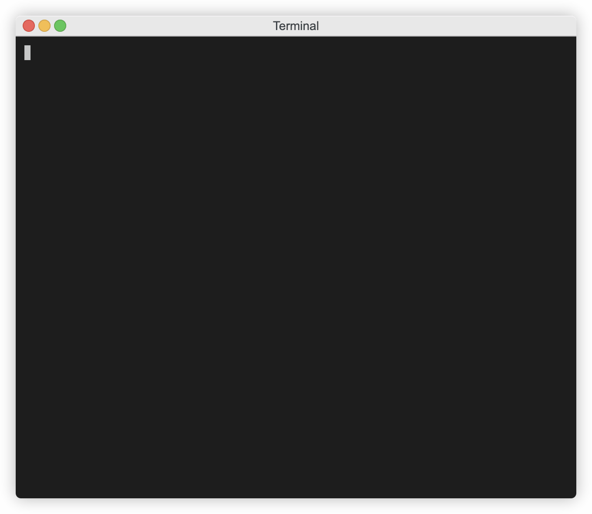
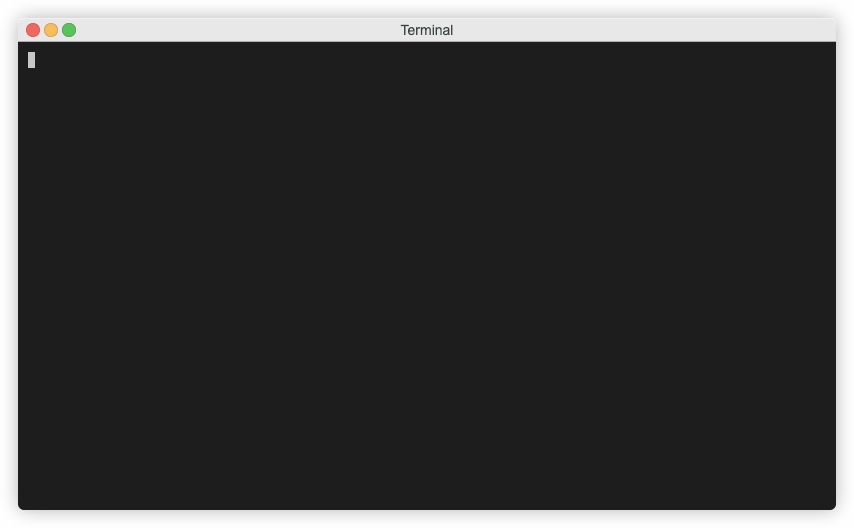
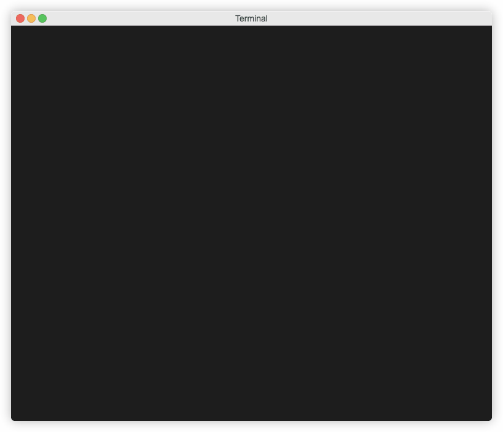
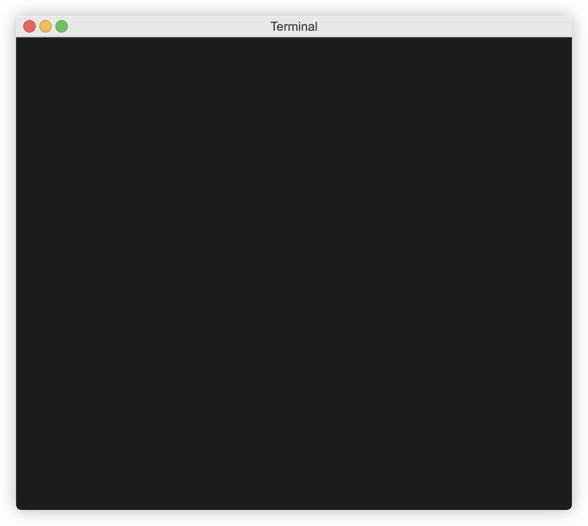
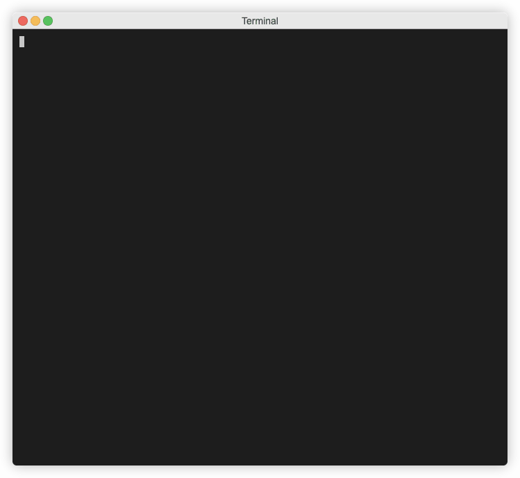
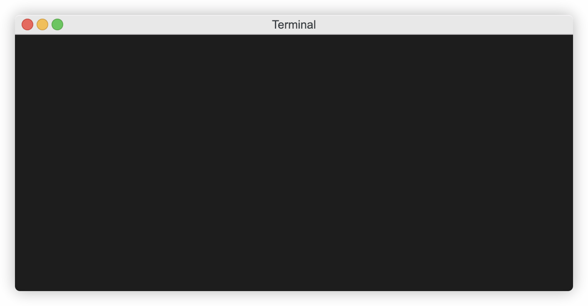

# Your First Config

If you followed the Getting Started steps, you now have ECS On-Premise server installed or have an ECS Cloud account, and have installed and initialized the CLI. Now it's time to create a config.

You can either read the config explanations below copying and pasting in examples, or you can [skip ahead](#learn-and-build-from-scratch) and build a config from scratch.

## Use Provided Examples

1) Change into the config repository directory you setup when you installed and initialised the CLI. Make sure you are in the `repo` subdirectory

2) If you installed ECS On-Premise server you've probably cloned the <a href="https://github.com/Cloud-Technology-Office/ecs-getting-started" target="_new">Getting Started Repo</a> to get this far. If this is the case you can copy the /config-examples directory from the Getting Started Repo to your config repository `repo` directory.

If you have an ECS Cloud account and therefore didn't need to clone the repo, you can change to the `repo` directory in your config repository and download all the examples by using the command below:

`wget -O - https://github.com/Cloud-Technology-Office/ecs-getting-started/archive/main.zip | tar xz --strip=2 "ecs-getting-started-main/config-examples"`

### YAML/ JSON Based Examples

Let's build the config in the examples, just as you would in your pipelines:

#### Example 1 (most basic of configs with no merging)

We call this legacy, it's probably how most of you are doing config today, one config per pipeline or per instantiation of the pipeline. 

Jenkins or some other pipeline tool might be passing in a team name, region, environment or accopunt ID in order for a script to  choose the right variables file. This is a very typical approach to sourcing variables.

 In this example we use pipeline 1 and pipeline 2 to represent different ways you might call your pipeline but with different variables, such as multiple tfvars files. Imagine pipeline 1 might be 1 environment tfvars and pipeline 2 is another one. 
 
 If you are using this approach, ECS will almost certainly be a drop in replacement for variables files used in your pipelines today, all you would need to do is let ECS generate the variables file from centralized config prior to pipeline run using the commands used in this example. 
 
 Using ECS Cloud it is likely you could go from legacy config to signup and go live with this approach inside 30 minutes. After you have got to that stage, then you can strealine your config from there as the rest of the examples will teach you. 

<a href="https://github.com/Cloud-Technology-Office/ecs-getting-started/tree/main/config-examples/example-1" __target="_new">Repo Example 1</a>


Commands used:  

  - `cto ecs config build --path config-examples/example-1/user-1 --recursive`  


Command used:  

  - `cto ecs config build --path config-examples/example-1/user-2 --recursive --filter ec2`  

  - `cto ecs config build --path config-examples/example-1/user-2 --recursive --filter 'ec2."user-2-instance-a"'`  

You can see user-2 had a slightly different config, and then we filtered it to retrieve just a single instance.

But isn't the goal of ECS is to move beyond this legacy approach and become more DRY.  Imagine when used at scale, if you need to change the AMI for all pipelines.

Let's move to a more DRY world.

#### Example 2 (Get more DRY and do a basic merge)

<a href="https://github.com/Cloud-Technology-Office/ecs-getting-started/tree/main/config-examples/example-2" __target="_new">Repo Example 2</a>



Command used:  
  
  - `cto ecs config build --path config-examples/example-2 --recursive`

Here, the content has been recursively merged from top to bottom. This only works for hierarchies that only have 1 path. For more than 1 team, you need to use strategies to tell the merger what to do. 

#### Example 3 (Use a basic strategy)

In this example we have a merge strategy defined that will load a common directory and build config for each team by merging their overrides over the top of common.

<a href="https://github.com/Cloud-Technology-Office/ecs-getting-started/tree/main/config-examples/example-3" __target="_new">Repo Example 3</a>



Command used:  

  - `cto ecs config build --path config-examples/example-3 --strategy-name merge_common_ec2_to_teams_ec2`

#### Example 4 (Use a multi object strategy)

In this example we will emit config for moore objects, not just the EC2 object.

<a href="https://github.com/Cloud-Technology-Office/ecs-getting-started/tree/main/config-examples/example-4" __target="_new">Repo Example 4</a>



Command used:  

  - `cto ecs config build --path config-examples/example-4 --strategy-name merge_common_objects_to_teams_objects`

  If you wanted to emit more objects, just edit the list_iterator to add more.

#### Example 5 (Use a config generation strategy to generate EC2s)

In this example we're going to generate config based on a list of configurations we would like. We will base it on common and expand it into multiple instances of the same config with named identifiers and with instance level override. 

Note in the output, how disk_size has been overriden for each team and instance. This is so useful if you want to have a pipeline manage a set of resources, such as Terraform doing a `for_each` over each instance. 

<a href="https://github.com/Cloud-Technology-Office/ecs-getting-started/tree/main/config-examples/example-5" __target="_new">Repo Example 5</a>


Command used:  

  - `cto ecs config build --path config-examples/example-5 --strategy-name generate_ec2s`

Let's assume the pipeline runs per team instead of all teams, to emit the config for team 1 only, and only for the `ec2` object, just add `--filter '"team-1".ec2'` on the end of the command.


Command used:  

  - `cto ecs config build --path config-examples/example-5 --strategy-name generate_ec2s --filter '"team-1".ec2'`

#### Example 6 (Use a config generation strategy to generate more objects)

Example 5 was only looking at `ec2` objects, let's extend that to cater for more object types.

<a href="https://github.com/Cloud-Technology-Office/ecs-getting-started/tree/main/config-examples/example-6" __target="_new">Repo Example 6</a>


Command used:  

  - `cto ecs config build --path config-examples/example-6 --strategy-name generate_listed_objects`

  You will see that we removed the hard coded `ec2` reference and instead iterate over a list of object types. 

### Pkl Examples

Using Pkl in ECS is really as simple as putting your Pkl files into a path in your config and using the following command to compile it:

`cto ecs config build --path <path to root Pkl file>`

When passing the `--format` option to the CLI, ECS will pass this to the Pkl binary and will return the requested format if the particular Pkl config supports that format. Where outout from Pkl comnfig is multi file YAML, the `--format` option is ignored.


#### Example 7 (A simple Pkl example)



Commands used:

`cto ecs config build --path config-examples/example-7/birds.pkl` 

`cto ecs config build --path config-examples/example-7/birds.pkl --format yaml`

`cto ecs config build --path config-examples/example-7/birds.pkl --format xml`

`cto ecs config build --path config-examples/example-7/birds.pkl --format properties`

`cto ecs config build --path config-examples/example-7/birds.pkl --format plist`

#### Example 8 (A complex Pkl example)

Pkl isn't always one file or even just local imports in a multi file config. This example pulls in external dependencies and outputs multi file YAML output. In the case where Pkl emits multi file YAML, the `--format` option is ignored.


Command used:

`cto ecs config build --path config-examples/example-8/k8s-frontend.pkl`

#### Example 9 (A multi Pkl file glob build)

This example uses a glob pattern to match multiple files. 


Command used:

`cto ecs config build --path /"config-examples/example-9/*/staging/us-west/*.pkl"`

And because this is an entire app manifest in multi file YAML format, it can be directly applied to your K8s cluster as follows:

`cto ecs config build --path /"config-examples/example-9/*/staging/us-west/*.pkl" | kubectl apply -f -`

#### Example 10 (A complete reference config)

Example 10 demonstrates how a configuration can be build to serve multiple teams needs. Is has config for core infrastructure, and also config specific to individual teams. It is a comprehensive example that is well documented in the getting started repo. See <a target="_new" href="https://github.com/Cloud-Technology-Office/ecs-getting-started/tree/main/config-examples/example-10">example 10</a>.

## Learn and Build from Scratch

Alternatively you can follow along below and create your own config from scratch and adapt the content and commands to suit.

1) Let's create a very basic config:, we'll create a team based config, each team will have their own settings for an EC2. Note, `team 2` has a different VPC name than `team-1`.

Important: Your config directory has been initialized as a local Git repo, it lives in a subdirectory `repo`. Your config needs to live in the `repo` directory, and all ECS commands take place in that directory.


Gif Content: (1)
{ .annotate }

1.  `teams/team-1/ec2.yaml` (1)
    { .annotate }

    1. 
    ```yaml
    ec2:
      instance_type    : t2.medium
      user_data        : null
      ami              : ami-123456789
      instance_profile : instance-profile-1
      disk_size        : 200
      vpc_name         : team-1-vpc
      tags:
        terraform : true
    ```

    `teams/team-2/ec2.yaml` (1)
    { .annotate }

    1. 
    ```yaml
    ec2:
      instance_type    : t2.medium
      user_data        : null
      ami              : ami-123456789
      instance_profile : instance-profile-1
      disk_size        : 200
      vpc_name         : team-2-vpc
      tags:
        terraform : true
    ```

    `cto ecs config push`

We've now created config for 2 teams and pushed it to ECS. You could take a look at your repository now and you will see what ECS is storing there. Note, _users.yaml file has your initial admin user with encrypted token stored. 


2) Now let's see how we can consume that in a pipeline.

The `cto ecs config build` command is what you use in your pipelines to generate consumable config. It has a `--path` parameter that allows config to be be extracted from anywhere in the path. If we specified `cto ecs config build --path /teams/team-2` we will get the following returned:

```yaml
{
  "ec2": {
    "instance_type": "t2.medium",
    "user_data": null,
    "ami": "ami-123456789",
    "instance_profile": "instance-profile-1",
    "disk_size": 200,
    "vpc_name": "team-2-vpc",
    "tags": {
      "terraform": true
    }
  }
}
```

If we only want the content under the `ec2` object, which is likely for your pipeline code, use `--filter` parameter to filter content out of the returned config. Let's see it in action:


Gif Content: (1)
{ .annotate }

1. `cto ecs config build --path /teams/team-2`

But how is that DRY I hear you say. Well, it's not, but it probably looks like many of your existing pipeline configurations. Now let's put the ECS touch on it and make it DRY!

First let's restructure the configuration a to give it a section for common config, then we'll override just the parameters that are different. In our example above, `team-2` had a specific VPC `team-2-vpc` whereas `team-1` had `default`. If the majority of teams had a VPC called `default` that should be the setting in common. Let's also override the default `disk_size` for `team-1`.


Gif Content: (1)
{ .annotate }

1.  `teams/common/ec2.yaml` (1)
    { .annotate }

    1. 
    ```yaml
    ec2:
      instance_type    : t2.medium
      user_data        : null
      ami              : ami-123456789
      instance_profile : instance-profile-1
      disk_size        : 200
      vpc_name         : default
      tags:
        terraform : true
    ```

    `teams/teams/team-1/ec2.yaml` (1)
    { .annotate }

    1. 
    ```yaml
    ec2:
      disk_size        : 300
    ```

    `teams/teams/team-2/ec2.yaml` (1)
    { .annotate }

    1. 
    ```yaml
    ec2:
      vpc_name        : team-2-vpc
    ```

Now let's add a strategy. 

In the teams directory, create `__strategies.yaml`

The contents is as follows:

`/teams/__strategies.yaml` - Note, this is in top level teams directory.
```yaml
strategies:
  teams_merge_common:
    operations:
      - for_each:
          iterator: $directory_data
          actions:
            - inject:
              - $common
              - $each_value.ec2
            - add_parent: ec2
    variable_definitions:
      common:
        path: ./common/
        type: data_with_key_from_object_field
        source_object_path: ec2
        destination_object_path: ''
      directory_data:
        path: ./teams/{team}/
        type: data_with_key_from_path
```

Next you need to push the config with `cto ecs config push`.

Now let's see how to consume DRY config in your pipeline. To do this we'll use the follow command:

`cto ecs config build --path teams --strategy-name teams_merge_common`

And we'll filter the output to get just `team-1`

`cto ecs config build --path teams --strategy-name teams_merge_common --filter '"team-1"'`

And we'll filter the output to get just `team-1` `ec2` object.

`cto ecs config build --path teams --strategy-name teams_merge_common --filter '"team-1".ec2'`

Note, filters follow JMSPath syntax. Read about JMSPath and try out filtering in the playground [here](https://jmespath.org/tutorial.html).


## Where Next?

Learn ECS strategies [here](../build_strategies)