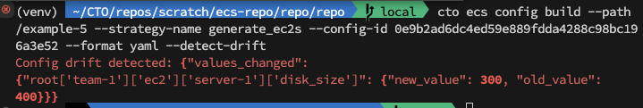

# Configuration Drift Detection

## Overview

As ECS uses common areas of config to facilitate DRY, another user may have upgraded something in the config that would affect a production pipeline. For this reason, in the case of production pipelines, it is typical to fix the version of config that is being used. 

This is where Drift Detection comes in. 

## Fixing Config Version

When a configuration is pushed, it returns a build ID. The build ID is the commit hash. This can be used to emit a specific version of config to a pipeline as follows:

`cto ecs config push`

This returns build ID that is then used in config build as follows:

`cto ecs config build --path <path> --config-id <build ID>`

Every time the config is built, it will be the same regardless of anyone elses changes. 

Let's say you don't know the build ID as you have not pushed any new config, but you want to fix the version. This is where tagging comes in. 

### Config Version Tagging

Tag the config at a particular point using thw following command:

`cto ecs config push --tag <tag>`

Run your pipeline and if it is successful, use that tag for future builds. If it fails and you need to adjust config, either use the emitted build ID from your config push or re-tag and use the tag.

## How Does Drift Detection Work?

Now you have your pipeline running on a fixed version of config, what if someone makes a change that should affect your pipeline, such as updating an AMI ID, changing a cost center tag, adding new region support, the list goes on. You may not be aware this change has been made but it should be deployed using your pipeline. 

Using the `--detect-drift` flag in conjunction with `--config-id` flags will cause a pipeline to fail if there is a new version of config available. This gives you a chance to observe the changes in the build output and re-tag and update your config build ID.

An example output where someone changed the common value for default instance size is as follows:

We are also working on a feature that will automatically notify you via email when a new version of config is available for your pipeline. 

## Where Next?

Check out the CLI reference [here](../cli)