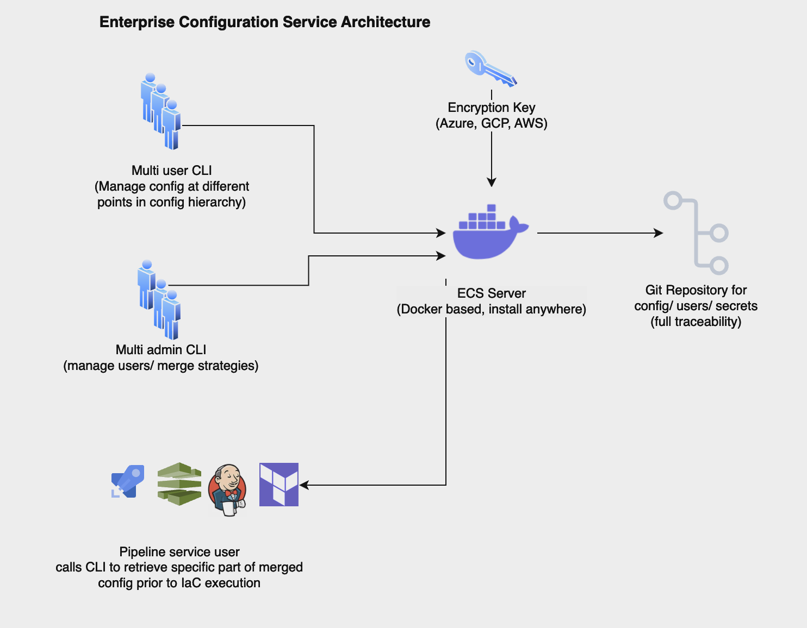
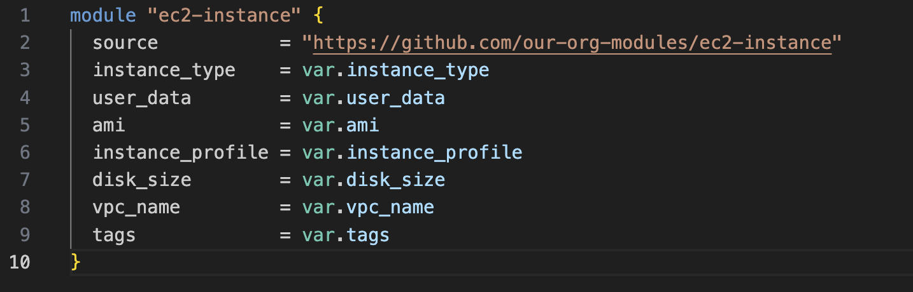
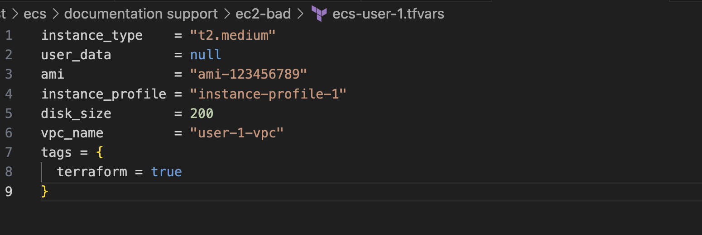
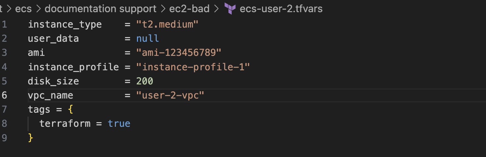
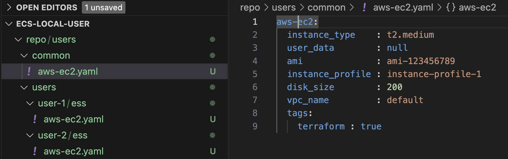
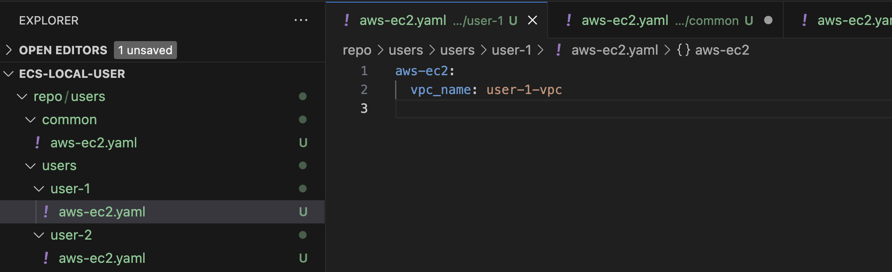
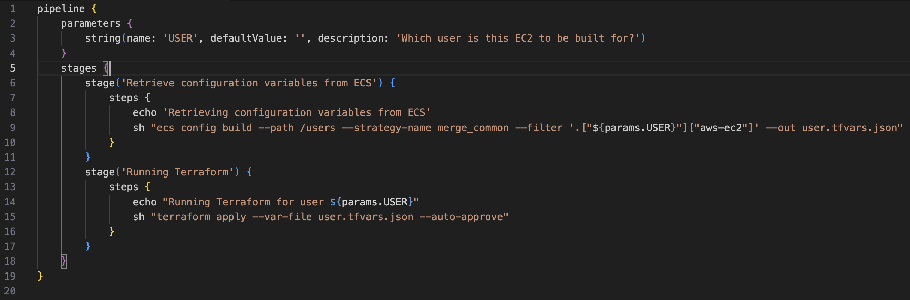

# About

Enterprise Configuration Service (ECS) is a brand new way to inject configuration into your pipelines. It aims to bring configuration under control and encourages you to keep it DRY (Don't Repeat Yourself). 

With ECS, instead of pipeline variables being scattered around the organizations estate in various repositories, it's stored in one or more centralized repositories. Using ECS it's still possible to split configuration in logical ways, but it's a choice rather than being forced through tooling limitations. 

A primary goal of ECS is to keep logic out of configuration in order to make it readable by anyone. When you start embedding merge logic into config it loses clarity and it takes a programmers mindset in order to understand what it does. With ECS, all config is defined in clean YAML files that anyone can comprehend. 

ECS uses artificial intelligence (CTO AI) to generate validation schemas for your production configurations. Creating schemas for validation is often an after thought, but with ECS we make it very easy, just type `cto ecs config schema –write` and a schema that matches your tested config output will be generated, that’s all there is to it. 

## Architecture

ECS is based on a central server, one per Git based configuration store. A small to medium sized organization only requires one configuration as it is divided up by it's hierachical nature. Your configuration can have multiple roots and can support any layout. If an organization requires it however, multiple servers can be setup to split config repositories. This would typically be required if it is necessary to split up user admin responsibilites. 

Users and pipelines interact with the configuration via the ECS CLI. Read about the CLI [here](./cli).

### ECS Cloud

ECS Cloud offers a very fast way to get up and running with centralized configuration. All you need is a Git repository that can be accessed via the Internet (we can provide you with an IP whitelist so you can lock access down to ECS Cloud) and an encryption key in AWS, GCP or Azure. You can even use an ECS Cloud created encryption key if you just want to get a feel for ECS, then recreate your configuration with a new key when you are ready to get serious about centralized config. 

See how to get started with ECS Cloud [here](installation/cloud.md). 

A 14 day free trial is available and you could be up and running with an environment that you can take to production within 5 minutes.

### ECS On-Premise

ECS can be installed on-premise using any Docker host such as AWS ECS, EKS or Azure AKS or Google GKE. ECS On-Premise is especially useful where you have a self hosted Git server that can't be accessed from the Internet. See how to get started with ECS on-premise [here](installation/server.md). 

Even better, you can start with ECS Cloud and then when you have got the feel for ECS, you can simply setup ECS On-Premise, using same repository and encryption key as you had configured in ECS Cloud, and the migration to on-premise is complete!

A 14 day free trial is available and similarly to ECS Cloud, if you have Docker installed locally you could be up and running with an environment to learn within 10 minutes.

## ECS Features

ECS embodies some powerful concepts such as:

- **Hierarchical Datastore** 
    - Datastore can be structured however it needs to be to represent your organizations needs
    - Project teams all have their own private area in which they can manage their config
    - The datastore can comprise of a mix of YAML, JSON and Apple Pkl meaning each project can use it's preferred configuration language
    - ECS layers functionality on top of Pkl such as output schema validation, webhooks, policy as code
- **DRY Config**
    - Powerful and configurable YAML/ JSON mergers that promotes the idea of DRY (Don't Repeat Yourself) configuration
- **Output Formats** 
    - Outputs specific parts of config to pipelines in various formats including YAML, JSON, .env and .ini. These formats make ECS compatible with AWS Cloudformation, Terraform, Kubernates and more. 
- **Secret Encryption**
    - **Uses Mozilla SOPS** under the covers but with a difference, **end users and pipelines don't need access to encryption keys.** The ECS server handles secret encryption which enables users to safely store secrets in your config repository, yes, in Git!
- **Git Based Database** 
    - The ECS server communicates with a central repository that you provide. This repository tracks all changes and maintains audit records and rollback capability
    - Users do not interact with the central repository thus enabling user access control
        - Without this, using a Git based approach for the configuration database, as all configuration management solutions should, all users would need access to the entire configuration
    - Users can be given read access to the Git repository so they can safely access the entire configuration landscape via the Git UI, but, they don't need it
- **Config Versioning**
    - Pipelines can be fixed to a certain version and new configs can be released in a controlled manor
- **AI Generated Schema Validation**
    - All config is tested for validity before it is loaded into the Git database so errors must be resolved before config is stored
    - **Use AI to build a schema** using the rich functionality of JSON Schema and any mismatches will be reported and will block builds thereby increasing reliability and consistency in deployments. AI will build a schema that exactly matches your output, giving you assurance your pipeline will fail if the build config is invalid
- **Drift Detection**
    - Optional block on pipelines that are running on outdated config. Pipelines running on a fixed version of config can be configured to fail if there is a new version of config available. 
- **Multi User CLI**
    - Admin level users manage users access and merge strategies
    - User level users can be granted readonly or read/write to specific areas of the config hierarchy
    - Service accounts are used by pipelines to consume areas of config they should be granted access to
- **Webhook Support** (coming soon) 
    - Change something in the config and configured webhooks can be fired to trigger pipelines
- **AI Generated Policy as Code** (coming soon) 
    -  With policy as code written in Rego, it is possible to control what users can enter into configuration, such as blocking expensive instance types or admin roles in IAM policies anywhere other than in root level IAM definitions. Rego policies take a while to get used to, our AI makes it easy

## Example of Non-DRY Configuration Storage

Most organizations store configurations in application/ user specific repositories and think they are DRY because they modularize the pipeline code, but the configuration for the pipeline is rarely DRY. See this example for deploying 2 separate AWS EC2 instances for 2 users:

This code is DRY, the module can be reused, all good so far.

Now we will deploy this for a user, all we need to do is create .tfvars and run Terraform.

User 1 configuration: 

Now user 2 needs an EC2 as well, they want exactly the same config other than user 2's VPC settings are different, no problem, copy user 1's config, change the VPC setting and run Terraform, all good.

**Wrong!** This is what we see all the time, duplication is rife. In this scenario it's not too bad as there are not many variables and there are only 2 sets of config, but complex modules with many variables, multiplied by many users and it becomes really hard to manage, and upgrading a module is really hard as all the .tfvars files need to be modified to suit new module requirements. 

## Example of DRY Configuration Storage

With ECS this is so much cleaner. First we define what is common for most users of the module:

Then for the individual user config we only need to override the VPC name

Imagine this at scale where configuration is stored centrally for many pipelines, your entire infrastructure can be described this way instead of with individual stores of pipeline variables. 

## Pipeline Integration 

What's even better is that ECS just emits the merged variables into your pipelines so they work exactly as they did before, no code changes needed other than to call ECS before running Terraform.

Here is an example of a simple Jenkinsfile that will generate the configuration for an EC2 based on a parameter.

This is just the beginning of how ECS can refine your configuration storage, read on to find out it's other features.

## Where Next?

Getting started with ECS is very easy, just follow the instructions [here](installation/server).

