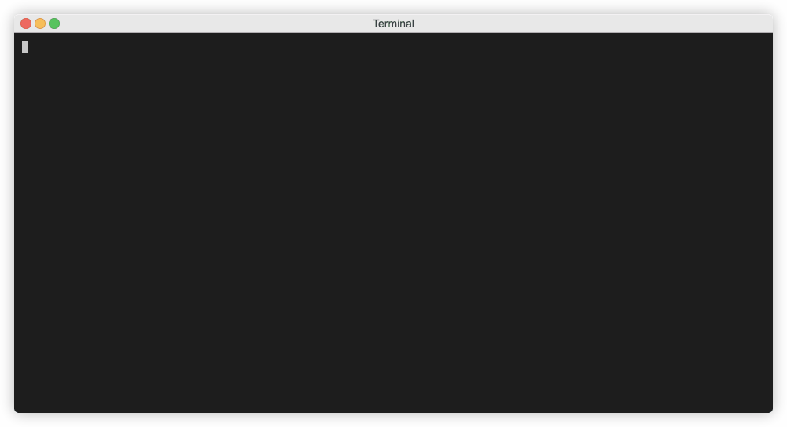
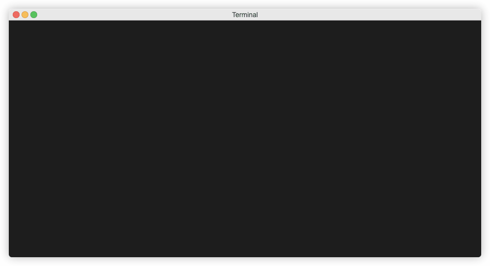

# Install and Setup CTO CLI

The ECS server should now be setup, if not, follow instructions [here](./server.md).

1) Ensure you have Python 3.8 or newer and install the CTO CLI with `pip install cto-cli`

2) Create an empty directory in which you will create your first configuration. This configuration will be pushed to the server/ centralized repo and will then be available to other ECS users and of course, your pipelines.

3) Change to your config directory

4) Initialize the ECS CLI:

####**ECS Cloud**

If you are setting up ECS Cloud initialize as below:

Note, the ECS Token comes from <a href="https://account.cloudtechnologyoffice.com" target="_new">https://account.cloudtechnologyoffice.com</a> portal, just click no product ECS, then Cloud details. 

####**ECS On-Premise**

If you are setting up ECS On-Premise initialize as below:

Command used: `cto ecs init`

5) You are now logged on as an administrator, your user got automatically created, your user token was automatically encrypted in the __users.yaml file in the root of your repo, and your user token was returned by the CLI and stored in `/.cto/ecs_settings.json`. 

6) A subdirectory of your created empty directory has been created, it is called `repo`, change to this directory. 

7) Let's get the config from the server, this will initialize your local config store with any config the user is authorized to work with, in your case, you are admin so you can see the entire config.

## Where Next?

Learn about configuration [here](../../config)