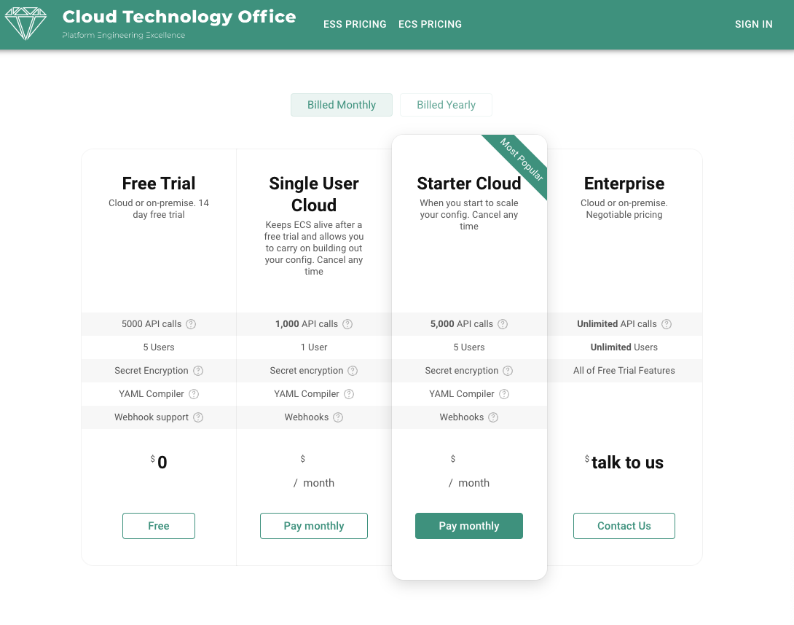
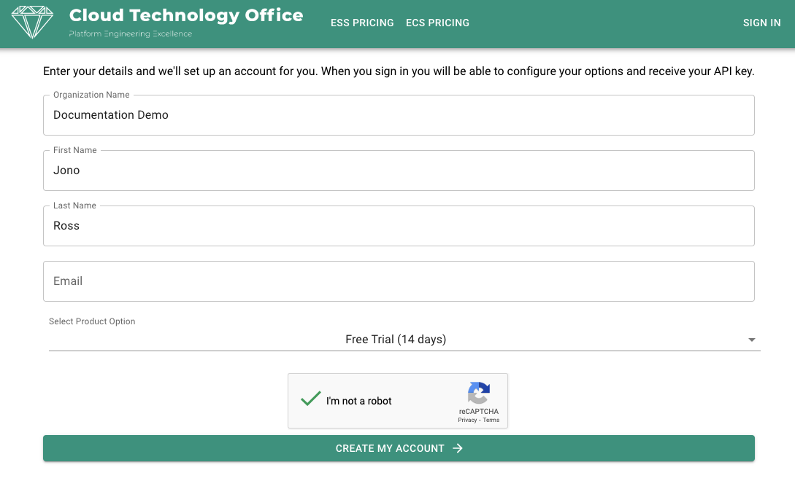
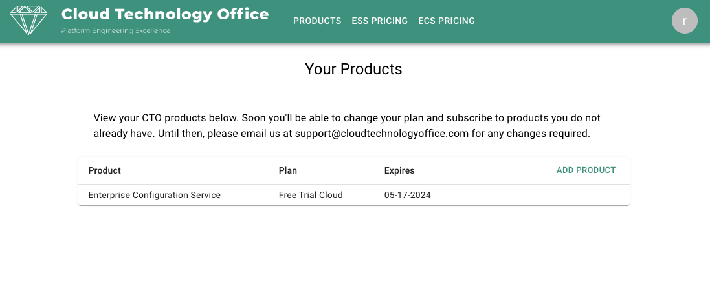
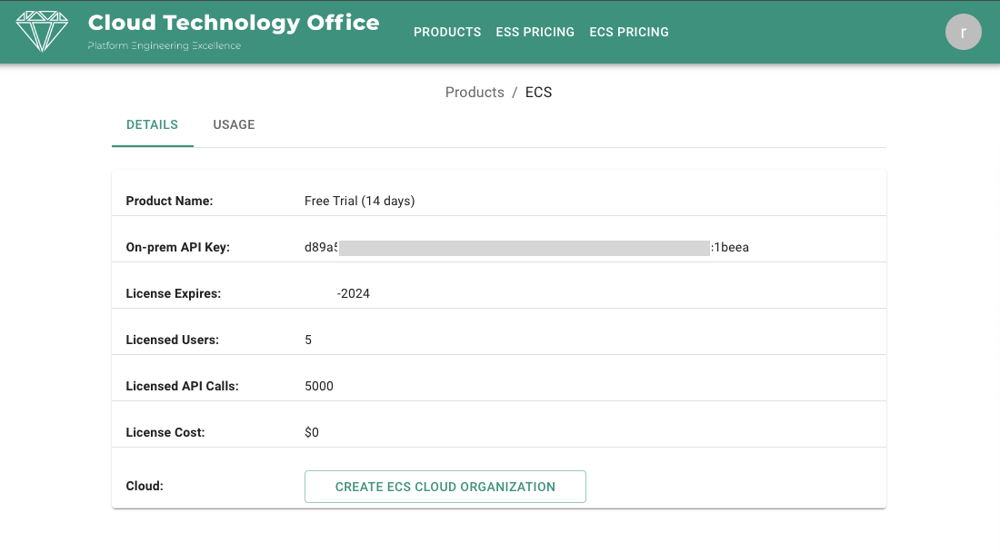
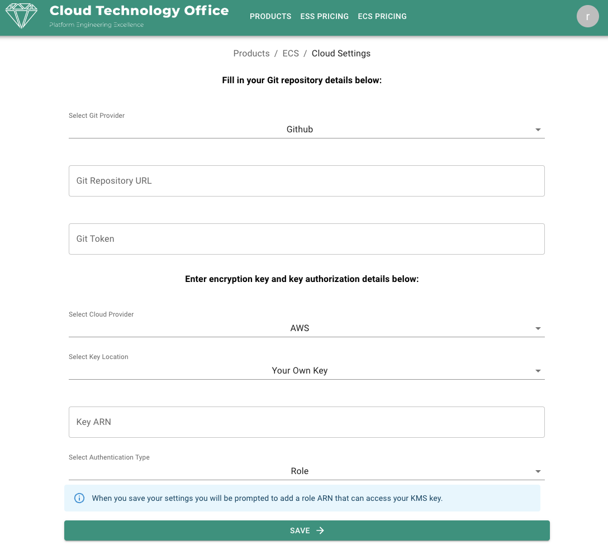
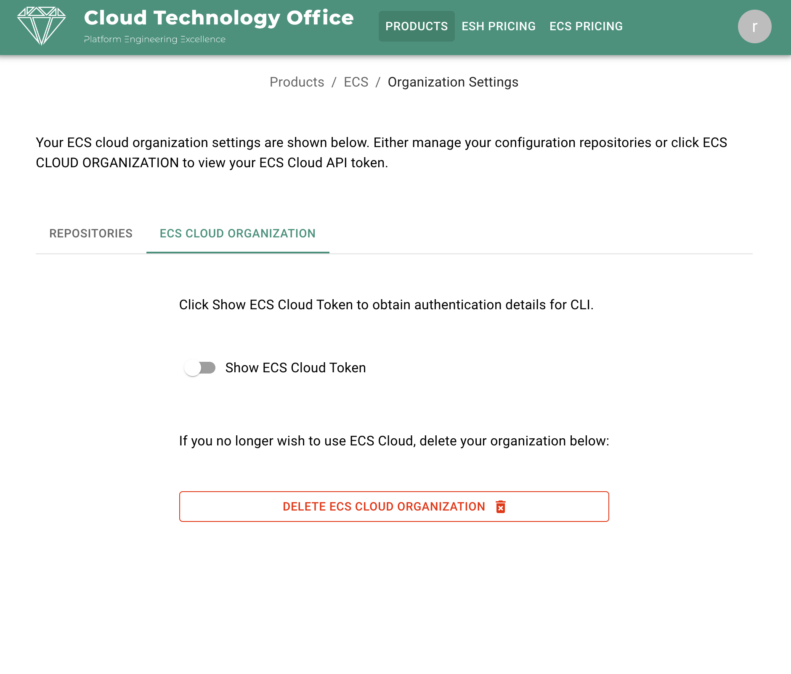
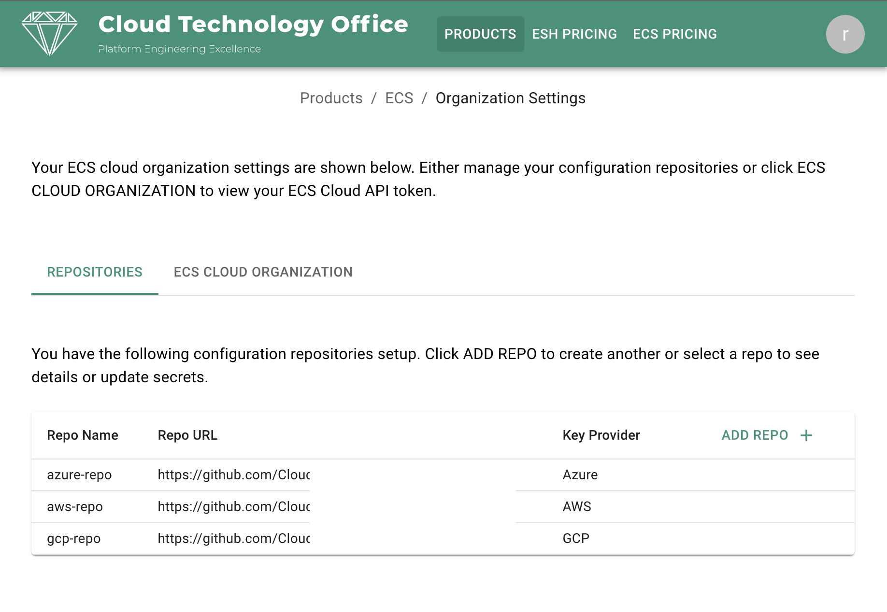

# ECS Cloud

You have a choice of using ECS Cloud or ECS On-Premise. If you choose to use ECS Cloud you're in the right place. Follow the steps below to get started. If you want to try ECS On-Premise, click [here](./server.md).

ECS Cloud gives you total control over your configuration. Whilst we are hosting the ECS server, you still use your own private repository to store the configuration. In addition, we encrypt secrets using either a key that we create especially for your ECS Organization, or you can choose to use your own encryption key hosted on any of AWS, Azure or GCP. 

Using your own encryption key is the best option for anything other than giving ECS a try as it will enable you to transition to ECS On-Premise very easily if you need to. You can start your ECS journey in the cloud and then simply install ECS server on-premise, use the same repository and encryption key and the transition is complete. This is possible since you supply the configuration repository. 

## Let's get started! 

1) Create a private repository in your Git server of choice, leave it empty

2) Create a token that has write access to the repository

3) Signup for ECS Cloud Free Trial or paid plan <a target="_new" href="https://cloudtechnologyoffice.com/ecs-pricing">here</a>



In this example I will choose the Free Trial. If you choose a paid option, you will be asked for payment information in order to enable your plan. 

When you signup you will have an option to configure your ECS Cloud Organization. 



Your username and password that you need to sign in to your CTO account will be emailed to you. Sign in and you will see the following:



Click on Enterprise Self Service and you will see your ECS plan details:



Click on CREATE ECS CLOUD Organization and then fill in your Git and encrpyption key details (see [Encryption Key Options](#encryption-key-options)).

If you haven't created an empty repository for your confiiguration, now is the time to do it. Make sure you create an access token that has read/ write privileges to the repo. Fill in repo and access token details, select encryption option and click SAVE. 




4) Install the ECS CLI by installing Python 3.8 or above and then install with ```pip install cto-cli```.

5) Copy your ECS API Token from your ECS Organization Settings page as below:



Now you have the API token, configure the CLI [here](./cli.md).


## Multiple Configuration Repository Support

ECS supports an unlimited number of indpendent configuration repositories. Even large organizations can organize the stucture of a single repository to fulfull the entire organizations needs, but where there is a need for greater segregation between org units or teams, ECS fully supports this.

An end user uses the ECS CLI to interact with a single repository. The repository name is configured when the CLI is configured.

To add multiple repositories, simply click ADD REPO as per screenshot below:



## Encryption Key Options

Create a key for SOPS to use for secret encryption:

- **AWS**

    - Either use a KMS encryption key that we create specifically for your ECS Organization or create your own
    - If you create your own KMS key, ECS Cloud can access it via:
        - A role that you provide (recommended). Note. We create a role in ECS Cloud specifically for your ECS Organization. You will configure your role to trust only your ECS Cloud role so rest assured no other ECS Cloud user can access your key
        - Provide user credentials in the form on AWS_ACCESS_KEY_ID and AWS_SECRET_ACCESS_KEY

- **Azure**

    - Create an Microsoft Vault key
    - Create a Service Principle that has role "Key Vault Crypto User" granted for the key
    - Note the following Service Principle variables
        - appId (ECS CLient ID)
        - password (ECS Client Secret)
        - tenant (ECS Tenant ID)
- **GCP**

    - Create a GCP Vault and key or add a key to an existing vault
    - Create a service account for ECS that has decrypt access to the key
    - Copy the service account credentials file and paste it in to your ECS Organization Settings page in the appropriate field

## Where Next?

Install and setup the CTO CLI to interact with the ECS Cloud by following instructions [here](./cli.md).